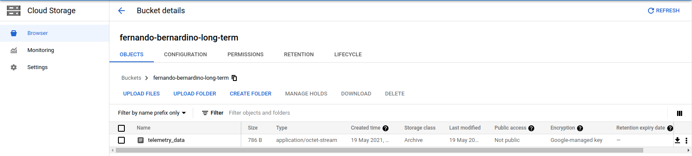
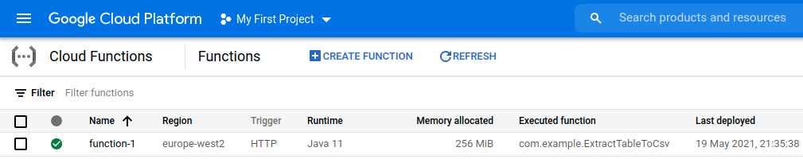
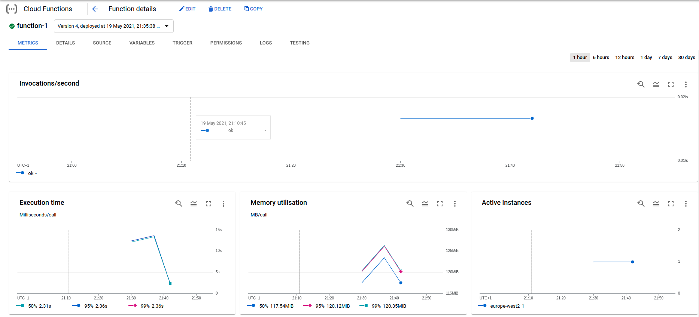
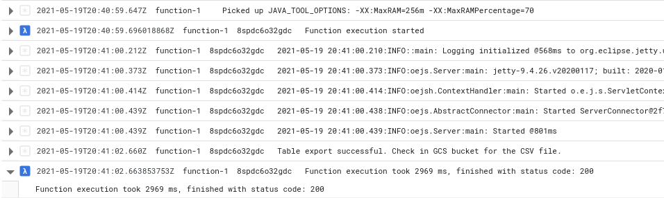
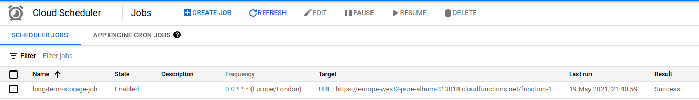
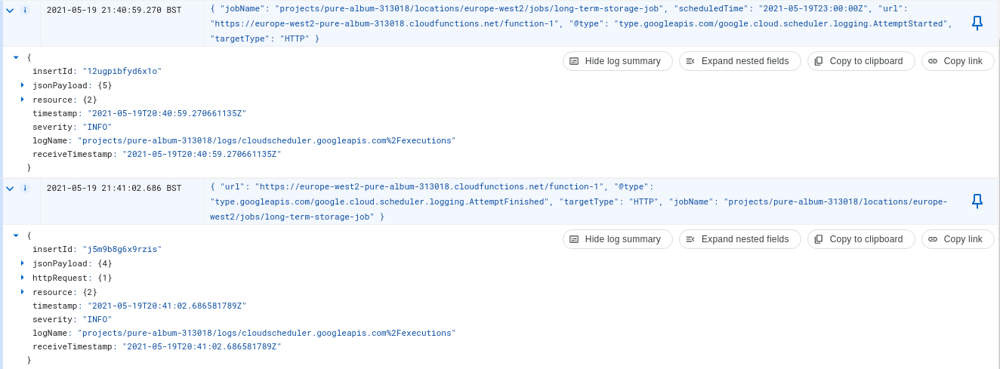

# Process data

## Milestone 1 - Implement a Coldest-Storage Layer for Storing the Telemetry for Long-Term
Data Streaming Pipelines with Google Cloud Platform - Storage Layer

## Bucket
Create the bucket `fernando-bernardino-long-term`, of type Archive. The
extracted data from `pure-album-313018:tsunami_reading.telemetry_data` was sent to it, to object
`telemetry_data`, with the data as CSV (see [telemetry_data](./telemetry_data) ).

## Cloud Function
Created the Cloud Function. Its source code is this project (see 
[com.example.ExportTableToCvs.java](../src/main/java/com/example/ExtractTableToCsv.java))

These are the invocations made to it:

These are the logs when function executed:

## Job

Then created the job to run once per hour (cron expression `0 0 * * *`):

These are the logs from one execution of the job:

