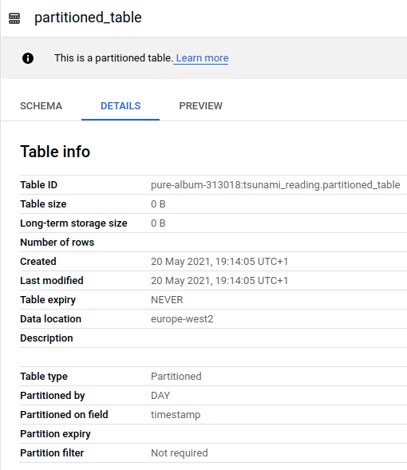
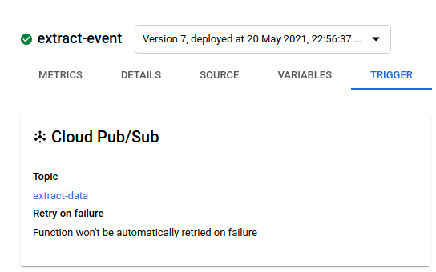
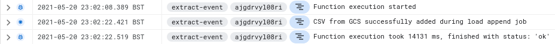
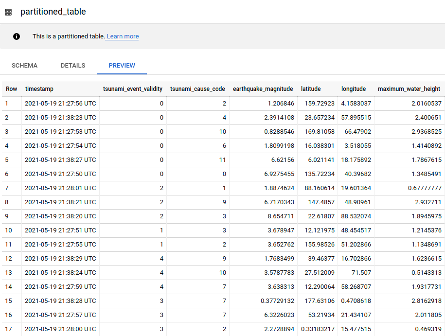
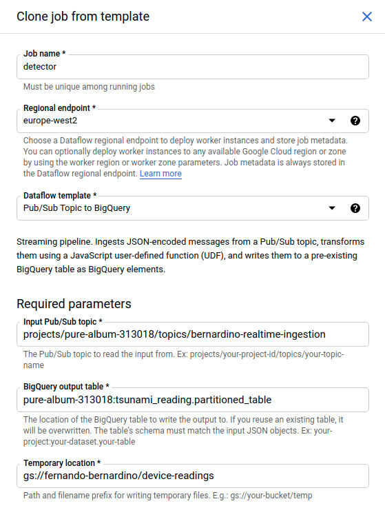
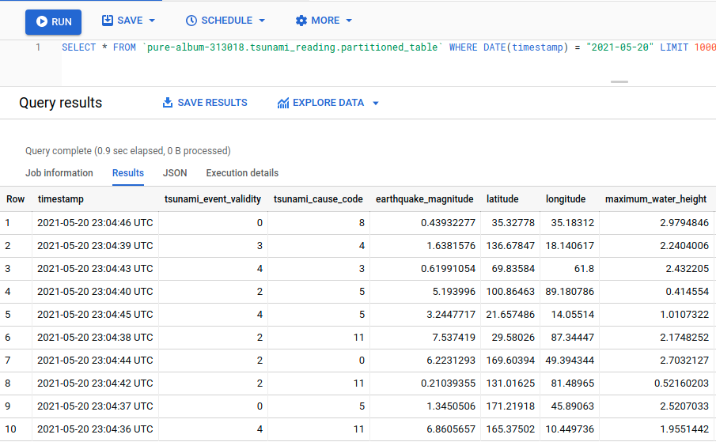
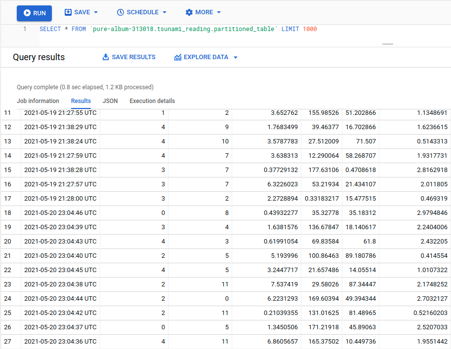
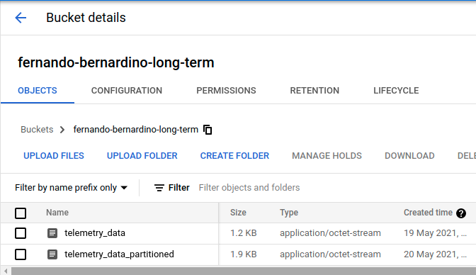
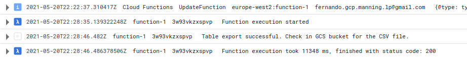

# Process data

## Milestone 2 - Modify BigQuery Table Schema for Optimized Querying and Data Analysis

Created the table `partitioned_table`, partition on field `timestamp`, by DAY:

Create a Cloud function to import the CSV data from `gs://fernando-bernardino-long-term/telemetry_data`, with
[com.example.ImportCvsToTable.java](../src/main/java/com/example/ImportCvsToTable.java), a background function.

Although it is listening in a topic, I didn't send any message to the topic, instead I triggered that background 
function from my machine with:

    $gcloud functions call --project pure-album-313018 --region europe-west2 extract-event --data '{}'
    executionId: ajgdrvyl08ri
    $

Where are the logs from its execution:

And here is the imported data in the partitioned table (20 rows total):

Created a new pipeline job from the one used to import to data from the topic 
`projects/pure-album-313018/topics/bernardino-realtime-ingestion` to the table, 
but this time saving the data into `partitioned_table`:

Executed the simulator again and waited for data to arrived at the partitioned table.

This is the newly added data, in the 2021-05-20 (10 rows total):

Here is the table data all together (30 rows total): 

Changed the previous extractor cloud function to export to newly partitioned to the long term storage,
`gs://fernando-bernardino-long-term/telemetry_data_partitioned`. (see
[com.example.ExtractPartitionedTableToCsv.java](../src/main/java/com/example/ExtractPartitionedTableToCsv.java))
and pushed the Scheduler job to run right away and trigger the that cloud function.
It generated the file [telemetry_data_partitioned](./telemetry_data_partitioned)

Here is the object resulting from the extraction:

And here is the logs from the execution of the cloud funtion:

